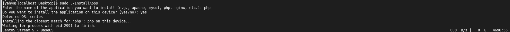

# Automated Application Installer

## Description
This script automates the process of detecting the operating system and installing common software packages. It can work locally or remotely over SSH. The script simplifies package installation for different Linux distributions (CentOS, RHEL, Fedora, Ubuntu, and Debian) by mapping application names to their closest package names in the respective package manager.

## Features
- Automatically detects the operating system type on local and remote machines.
- Installs common software like Apache, MySQL, PHP, Docker, and others based on the provided application name.
- Supports installation locally or on remote devices via SSH.
- Provides fallback messages if the operating system or package isn't supported.

## How It Works
1. The user specifies the application name (e.g., `apache`, `mysql`, `php`).
2. The script detects the OS type (either local or remote).
3. It maps the given application name to its closest package for the detected OS.
4. The script uses the package manager (`yum`, `apt`) to install the application locally or remotely.

## Supported Applications
| Application Name | CentOS/RHEL/Fedora Package | Ubuntu/Debian Package    |
|------------------|----------------------------|--------------------------|
| Apache           | `httpd`                   | `apache2`                |
| MySQL            | `mariadb-server`          | `mysql-server`           |
| PHP              | `php`                     | `php`                    |
| NGINX            | `nginx`                   | `nginx`                  |
| PostgreSQL       | `postgresql-server`       | `postgresql`             |
| Docker           | `docker-ce`               | `docker`                 |
| Redis            | `redis`                   | `redis-server`           |
| MongoDB          | `mongodb-org`             | `mongodb`                |
| Git              | `git`                     | `git`                    |
| Python           | `python3`                 | `python3`                |
| Java             | `java-1.8.0-openjdk`      | `openjdk-8-jdk`          |
| Node.js          | `nodejs`                  | `nodejs`                 |
| VSCode           | `code`                    | `code`                   |

## Requirements
- Linux-based OS (CentOS, RHEL, Fedora, Ubuntu, Debian).
- SSH access for remote installation (password-less authentication recommended).
- Root or sudo privileges.

## Usage
### **Run Locally**
```bash
sudo ./install_app.sh
```
- Enter the application name when prompted.
- Confirm installation on the local device.

### **Run for Remote Installation**
```bash
sudo ./install_app.sh
```
- Enter the application name when prompted.
- Choose **No** for local installation.
- Provide the remote device's IP address and SSH username.

## Example
1. Install Apache on the local device:
   ```bash
   Enter the name of the application you want to install: apache
   Do you want to install the application on this device? (yes/no): yes
   ```

2. Install MySQL on a remote server:
   ```bash
   Enter the name of the application you want to install: mysql
   Do you want to install the application on this device? (yes/no): no
   Do you want to install the application on a remote device? (yes/no): yes
   Enter the remote device's IP address: 192.168.1.100
   Enter the SSH username for the remote device: user
   ```

## Limitations
- Limited to common applications listed in the script.
- Requires SSH access to remote devices.
- Unrecognized operating systems or application names will result in a "No package found" message.

## Notes
- Ensure the script is run as `root` or with `sudo`.
- Customize the list of packages in the `find_closest_package` function to add more applications as needed.
